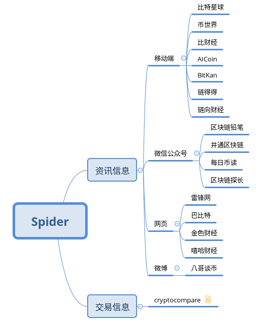

# 数据是个好东西

## 爬虫任务

总共分为两大类：资讯信息、交易信息。详情如下图：

## 资信信息

资信信息包含移动端、微信公众号、网页、微博

**移动端**

- [ ] 比特星球
- [ ] 币世界
- [ ] 比财经
- [ ] AICoin
- [ ] BitKan
- [ ] 链得得
- [ ] 链向财经

**微信公众号**

- [ ] 区块链铅笔
- [ ] 井通区快链
- [ ] 每日币读
- [ ] 区块链探长

**网页**

- [ ] 雷锋网
- [x] 巴比特
- [x] 金色财经
- [ ] 嘻哈财经

**微博**

- [ ] 八哥谈币

### 交易信息

- [ ] **cryptocompare**

## 数据存储

离线数据：MongoDb

在线数据：Kafka